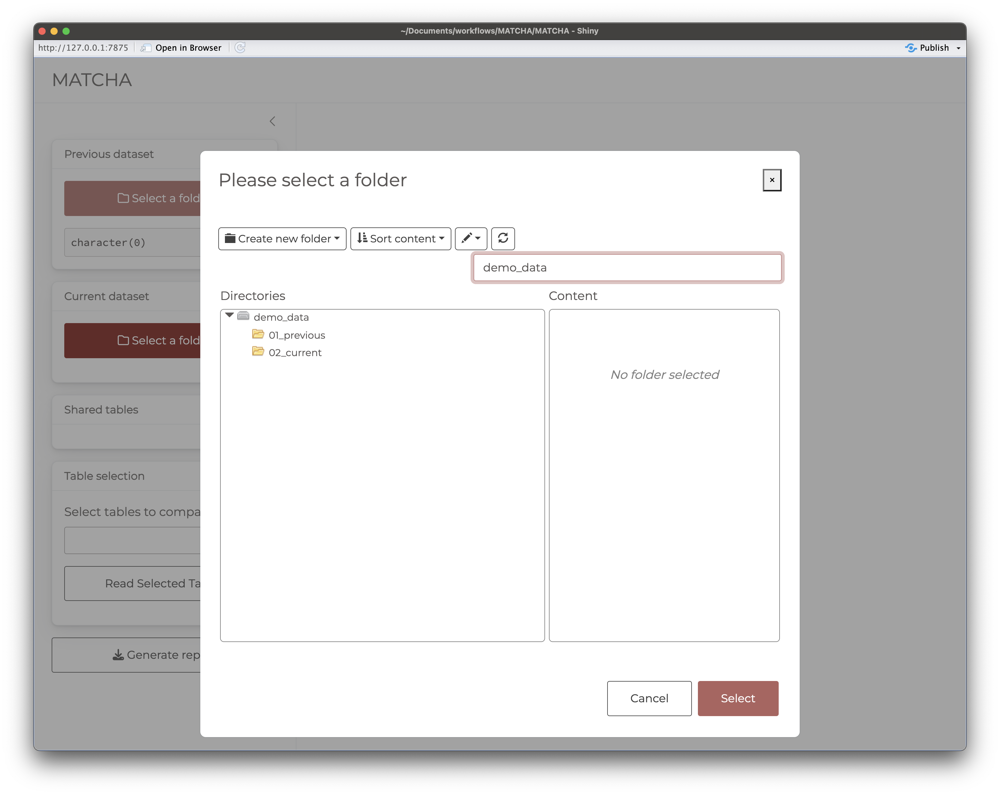
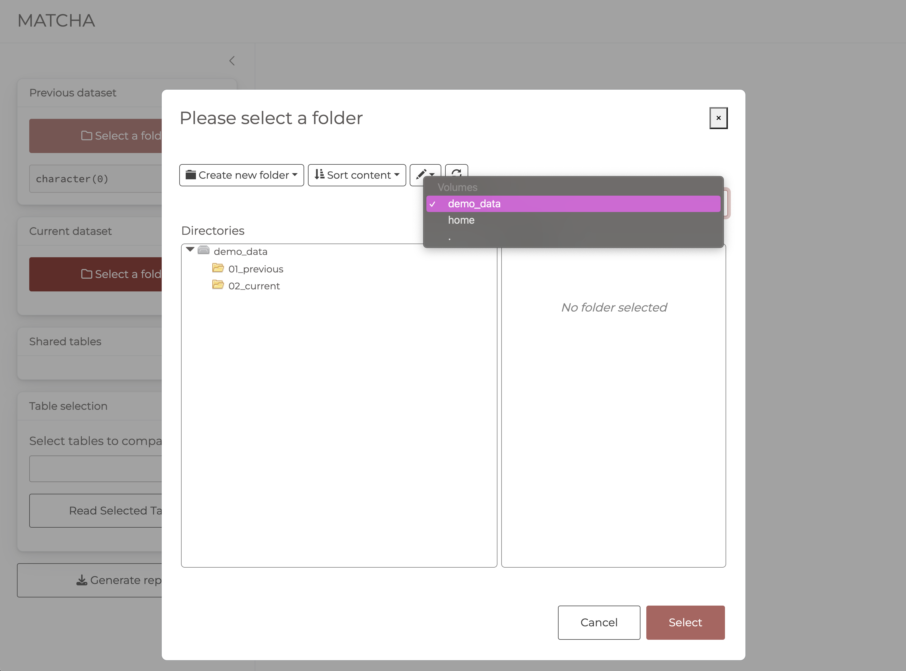

<!-- README.md is generated from README.Rmd. Please edit that file -->

```{r, include = FALSE}
knitr::opts_chunk$set(
  collapse = TRUE,
  comment = "#>",
  fig.path = "man/figures/README-",
  out.width = "100%"
)
```

# MATCHA

<!-- badges: start -->
[](https://lifecycle.r-lib.org/articles/stages.html#experimental)
<!-- badges: end -->

The goal of MATCHA is to provide an interface for producing data consistency reports.

## Installation

You can install the development version of MATCHA from [GitHub](https://github.com/) with:

``` r
# install.packages("remotes")
remotes::install_github("IeDEA-SA/MATCHA")
```

> NOTE: Because the repository is currently private, **installation will require that you have created a GitHub Personal Authorisation Token (PAT)** and made it available to the session (this is necessary for interacting through https with private repositories). 
>
> Follow [these instructions](https://happygitwithr.com/https-pat) to create, store and make your PAT available to your R session.


## Example

To run the app, load the library and run the `run_app()` function.

```{r example, eval=FALSE}
library(MATCHA)
## basic example code
run_app()
```

## Select previous & current data

The first step involves selecting the directories containing the previous and current data to be compared.
The directories can be selected by clicking on the `Select a folder` button.

The file system navigator will open in the root of the demo data contained within the package. You can use this data to explore app functionality.

```{r, echo=FALSE}


```

To select another root, click on the `demo_data` button in the top right corner of the file system navigator.

Selecting **home** will set the root to **your home directory** from where you can navigate to your own directories containing the previous and current data.
