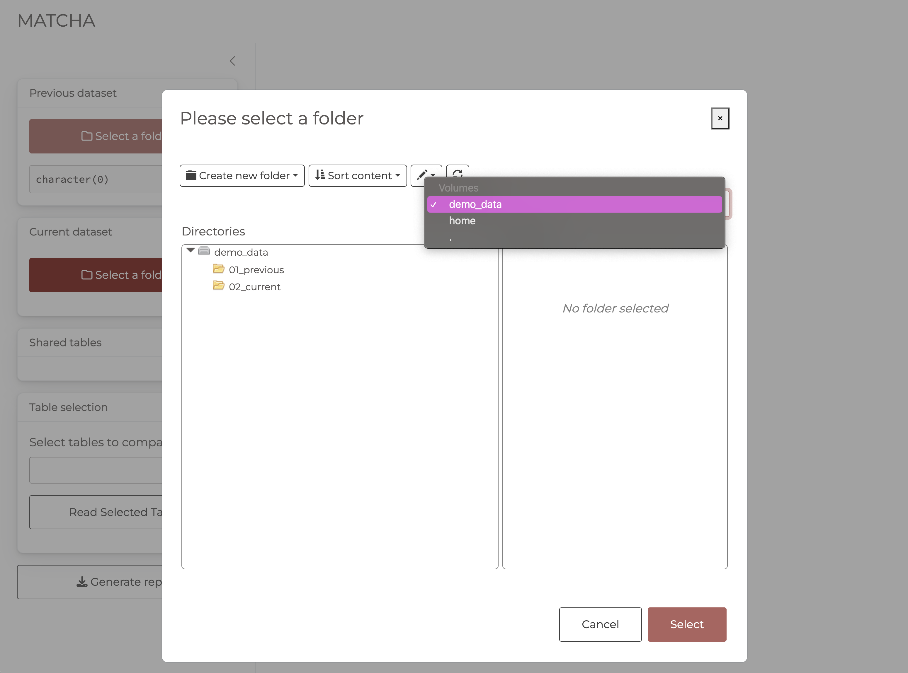

<!-- README.md is generated from README.Rmd. Please edit that file -->

# MATCHA

<!-- badges: start -->

[](https://lifecycle.r-lib.org/articles/stages.html#experimental)
<!-- badges: end -->

The goal of MATCHA is to provide an interface for producing data
consistency reports.

## Installation

You can install the development version of MATCHA from
[GitHub](https://github.com/) with:

``` r
# install.packages("remotes")
remotes::install_github("IeDEA-SA/MATCHA")
```

Alternatively, you can use package `pak`

``` r
# install.packages("pak")
pak::pak("IeDEA-SA/MATCHA")
```

> NOTE: Because the repository is currently private, **installation will
> require that you have created a GitHub Personal Authorisation Token
> (PAT)** and made it available to the session (this is necessary for
> interacting through https with private repositories).
>
> Follow the following instructions to:
>
> - [create a GitHub PAT](https://happygitwithr.com/https-pat#get-a-pat)
> - [use the `credentials` 📦 to store and make your PAT
>   available](https://happygitwithr.com/https-pat#credentials-package)
>   to your R session.
>
> You can make your PAT available to any fresh R session by adding
> `credentials::set_github_pat()` to your `.Rprofile` file. This will
> run `credentials::set_github_pat()` at the start of each session,
> ensuring your PAT is available in the environment. To open your
> `.Rprofile` file for editing, run `usethis::edit_r_profile()`.

## Example

To run the app, load the library and run the `run_app()` function.

``` r
library(MATCHA)
## basic example code
run_app()
```

## Select previous & current data

The first step involves selecting the directories containing the
previous and current data to be compared. The directories can be
selected by clicking on the `Select a folder` button.

The file system navigator will open in the root of the demo data
contained within the package. You can use this data to explore app
functionality.


### Select another root directoy

To select another root directory, for example your home directory so you
can navigate other folders on your system, click on the `demo_data`
button in the top right corner of the file system navigator.

Selecting **home** will set the root to **your home directory** from
where you can navigate to your own directories containing the previous
and current data.


