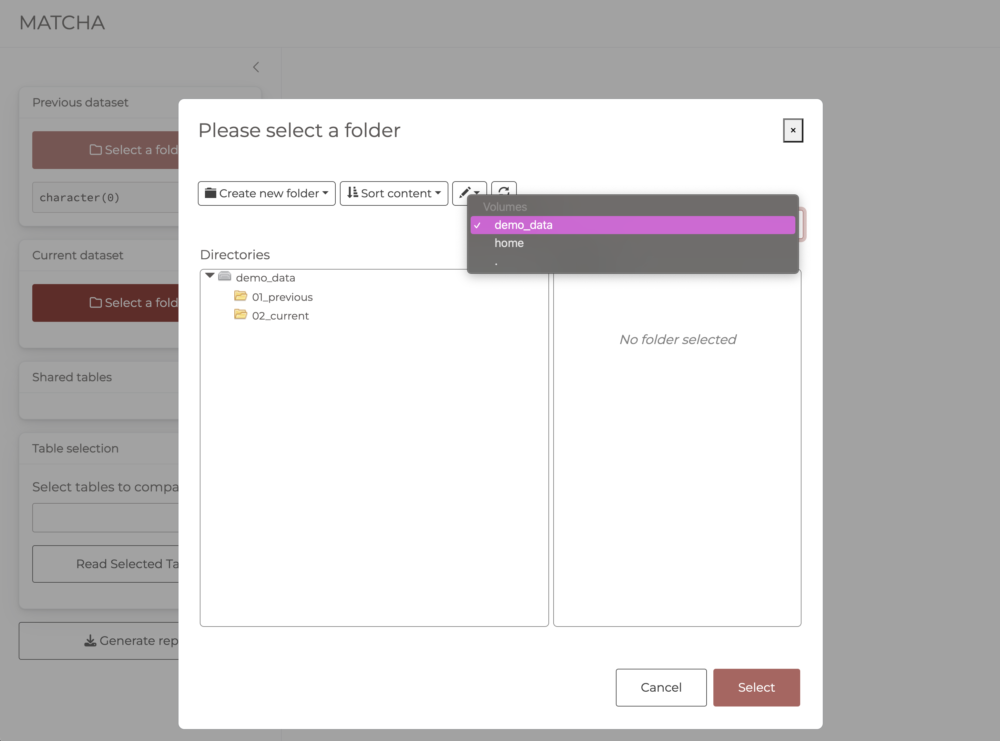

```{r, include = FALSE}
knitr::opts_chunk$set(
  collapse = TRUE,
  comment = "#>"
)
```


## Running MATCHA

To run the app, load the library and run the `run_app()` function.

```{r example, eval=FALSE}
library(MATCHA)
## basic example code
run_app()
```


### Overriding default Primary Key source settings

Some plots require primary key information to be provided. By default, the app will attempt to infer the primary key from the data and store it centrally. It is configured to consider:

- a **table named `tblBAS` as the primary source** of primary key information.
- within the primary table, the **column `patient` to contain the actual primary key values**.

However, you can override this at runtime through arguments `pk_tbl_name` and `pk_col` in the `run_app()` function respectively.

For example, if you wanted to configure the app to use a table called `tblKEYS` with a primary key column `id` as the source of primary key information, you would run the app as follows:

```{r, eval=FALSE}
run_app(pk_tbl_name = "tblKEYS", pk_col = "id")
```


## Select previous & current data

The first step involves selecting the directories containing the previous and current data to be compared.

The directories can be selected by clicking on the `Select a folder` button.

The file system navigator will **open in the current working directory (`"."`) in which the app is running** so the most efficient way of accessing data is to launch the app from the directory containing the previous and current directories of tables you want to compare. 

```{r, echo=FALSE}
knitr::include_graphics("select_directories_a.png")
```


### Select another root directory

There is however the option to select select another root directory, for example your home directory so you can navigate other folders on your system.

To change the root directory, click on the drop down menu (`.`) in the top right corner of the file system navigator.

#### `home` directory

Selecting **home** will set the root to **your home directory** from where you can navigate to your home directory for directories containing the previous and current data.

```{r, echo=FALSE}

```

#### `demo_data` directory

This will open the demo data contained within the package. You can use this data to explore app functionality.

```{r, echo=FALSE}
knitr::include_graphics("select_directories_a.png")
```


#### Data requirements

Allowed file formats include **`.csv`**, **`.rds`**, **`.dta`**, **`.sav`**, **`.por`**, **`.sas7bdat`** and **`.sas7bcat`**.

Please ensure that **directories do not contain files with the same name but different extension/formats**.

Please ensure csv files have ISO date format (**`YYYY-MM-DD`**)
