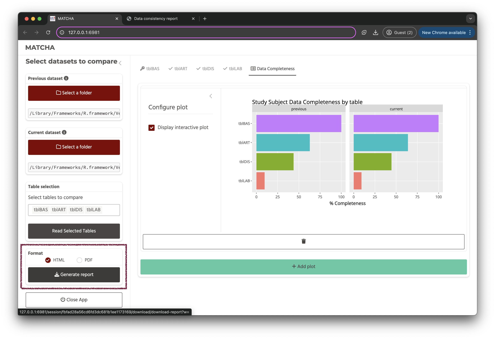

```{r, include = FALSE}
knitr::opts_chunk$set(
  collapse = TRUE,
  comment = "#>"
)
```


## Running MATCHA

To run the app, load the library and run the `run_app()` function.

```{r example, eval=FALSE}
library(MATCHA)
## basic example code
run_app()
```


### Overriding default Primary Key source settings

Some plots require primary key information to be provided. By default, the app will attempt to infer the primary key from the data and store it centrally. It is configured to consider:

- a **table named `tblBAS` as the primary source** of primary key information.
- within the primary table, the **column `patient` to contain the actual primary key values**.

However, you can override this at runtime through arguments `pk_tbl_name` and `pk_col` in the `run_app()` function respectively.

For example, if you wanted to configure the app to use a table called `tblKEYS` with a primary key column `id` as the source of primary key information, you would run the app as follows:

```{r, eval=FALSE}
run_app(pk_tbl_name = "tblKEYS", pk_col = "id")
```


## Select previous & current data

The first step involves selecting the directories containing the previous and current data to be compared.

The directories can be selected by clicking on the `Select a folder` button. This launches a file system navigator that will allow you to navigate your file system for data directories.


The file system navigator will **open in the current working directory (`"."`) in which the app is running** so the most efficient way of accessing data is to launch the app from the directory containing the previous and current directories of tables you want to compare. 


### Select another root directory

There is however the option to select select another root directory, for example your home directory so you can navigate other folders on your system.

To change the root directory, click on the drop down menu (`.`) in the top right corner of the file system navigator.

```{r, echo=FALSE}

```

#### `home` directory

Selecting **home** will set the root to **your home directory** from where you can navigate to any location on your home directory for directories containing the previous and current data.

#### `demo_data` directory

This will open the demo data contained within the package. You can use this data to explore app functionality.

We'll use the `demo_data` directory and work with the `csv` versions of the data for the rest of this guide.

```{r, echo=FALSE}

```

### Select directories for comparison

To select a directory, use the left hand side panel. The right hand side panel just displays the contents of the selected directory.


```{r, echo=FALSE}

```

#### Data requirements

Allowed file formats include **`.csv`**, **`.rds`**, **`.dta`**, **`.sav`**, **`.por`**, **`.sas7bdat`** and **`.sas7bcat`**.

Please ensure that **directories do not contain files with the same name but different extension/formats**.

Please ensure csv files have ISO date format (**`YYYY-MM-DD`**)


## Select tables

Once the directories are selected, the app will determine which tables are shared between the previous and current directories and allow to select which of them you would like to load.

```{r, echo=FALSE}

```


The first table it will automatically select is the **primary table**. This is the table that contains the primary key information. If this table cannot be identified, the app will return an error message.

Once all the tables you want to load have been selected, click on the `Read Selected Tables` button.

The app will read, check and clean tables, ready for comparison and plotting. It will open a new tab for the table loaded as well as a **Data Completeness** tab.


<div class="alert alert-info" role="alert">

NOTE: When a table, the app creates a unique hash from the table metadata and keeps track of it to ensure the same table is not unnecessarily reloaded and plots lost when reading in more tables. 

If you make changes to a table or select new source directories, the app will notice the change in metadata and reload a table, even if it has the same name as table previously loaded.

</div>

## Table Panels

To view information and plot comparisons of variables for a given table, click on the table name on the navigation bar at the top of the app.


At the top of the table panel, you will see a drop down with the current primary key column, used to compare data completeness against the primary key column in the primary key table. This allows you to change the primary key column for a table if necessary.

This is followed by a summary of the valid shared columns identified in the table and an accordion panel with further details about the table validation checks.

### Variable validation panel

The **Variable validation** panel contains a summary of the variable checks performed on the columns of the columns.


### tbl Structure panel

The tbl Structure panel contains a summary of the structure of the table (the output of the `skimr::skim()` function) for each data set (previous & current), including the number of rows and columns, the number of unique values in each column, and the number of missing values in each column and data type specific summaries of the contents of each column. 

If you need to trouble shoot any issues with the data when using the app, this your best starting point.


### Configure Table schema panel

The **Configure Table schema** panel allows you to change the data type and define a value to be considered as unknown (which will be encoded as `NA`) for each variable in a table. 


You can check the tbl Structure panel to check your changes. 

Note that this does not overwrite the original data. So if you do mess your data up by mistake, you can just change the data type back to the original data type and the original data will be restored.

## Add plot

To add a plot, click on the `Add Plot` button.


This opens up the plot selection dialog panel.


The first drop down menu allows you to select the plot type you want to add. The following (if any) drop down menus will adjust according to the requirements of each plot. Some plots only require one variable (`x`), others require two (`x` & `y`). The choices for each variable drop down will adjust to the variables that meet the data type requirement for each plot argument. Click **Ok** to add the plot.

Note that all `NA` columns are ignored as variable choices. If there are no variables matching the required data type, adding the plot will be disabled.


### Plot configurations

When you add a plot, it appear in a card with a configuration side panel. 


By default, plots are interactive and you can get more information by hovering over data in the plot.


The side panel contains plot specific widgets allowing you to interactively change the plot configuration.

For example, in the following example, we switched the time bin from **day** to **year**.


and then switched between an interactive and static plot.


TIP: each plot type has it's own help file. You can access the help file on the reference page of package documentation website and see details of the expected inputs and plot configurations.

### Data Completeness panel

The Data Completeness panel can only create a single plot type, the **Study Subject Data Completeness plot**. 


This plot shows the proportion of missing data for each primary key variable in each table as compared to the values in the primary key variable in the primary key table.


## Generating a report

To generate a report, click on the `Generate Report` button (_Note: If no plots have been created, you will just get an empty report._) 

You can choose between an HTML or a PDF report.
- HTML reports contain interactive versions of the plots (unless non interactive versions of plots were selected in the app when saved).
- PDF reports always contain static versions of the plots.



The report download behaviour will depend on your browser settings. 

### Report contents

The report will contain all the plots that have been created in the app as well as the tbl Structure summaries for any table with plots. Any plots in the Data Completeness panel will be shown first.


In the HTML report, the tbl Structure summaries will be hidden by default and can be toggled on and off by clicking on the table name.


## Closing the app

To close the app, click on the `Close App` button at the bottom of the left hand app navigation panel.


